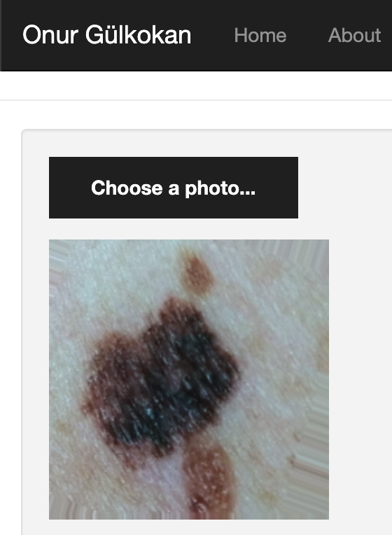
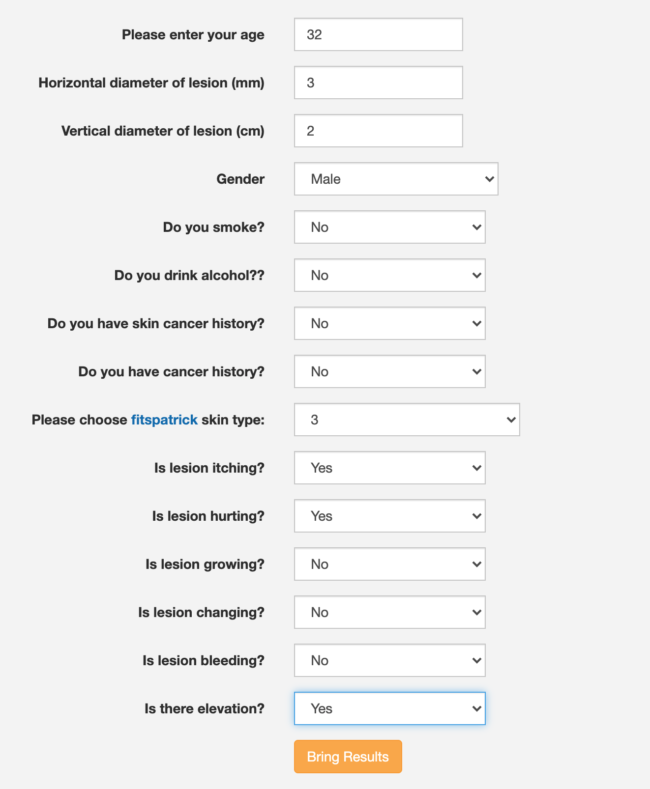
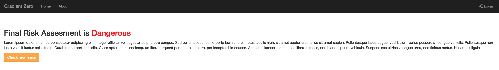

# Skin Cancer Risk Assesment App

Computer-Assisted Risk Assessment of Skin Lesion Using Clinical Images using ensemble Machine Learning models.  



  

<br/>

# How to run locally
First create new environment using anaconda:

```bash
conda create -n skinflask python=3.8
```

Then activate environment:

```bash
conda activate skinflask
```

Install requirements:
```bash
pip install -r requirements.txt
```

Run development server:
```bash
flask run
```